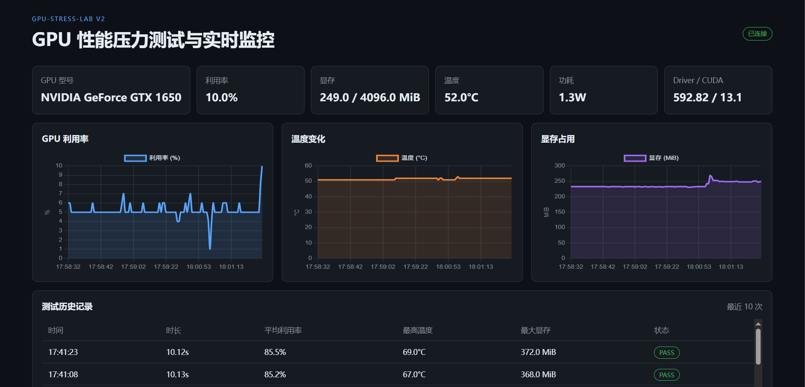
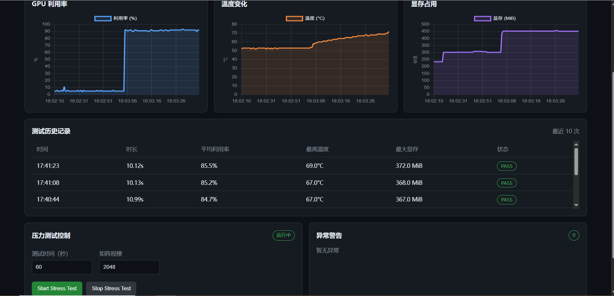
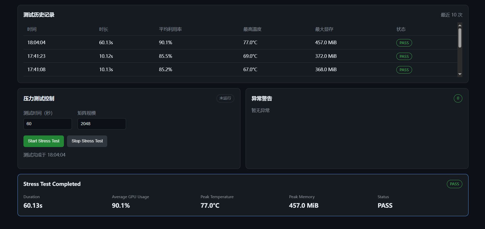

# GPU-Stress-Lab

GPU-Stress-Lab 是一个面向 Linux/WSL2 GPU 环境的性能压力测试与实时监控系统。

项目基于 NVIDIA `nvidia-smi` 和 PyTorch CUDA，提供 GPU 信息查询、环境诊断、实时监控、CUDA 矩阵乘法压力测试，以及基于 Flask 的 Web Dashboard。

## Features

- GPU 型号、驱动、CUDA、显存、利用率、温度和功耗查询
- CLI 实时 GPU 监控，固定终端区域刷新，避免滚屏
- PyTorch CUDA 持续矩阵乘法压力测试
- Flask Web Dashboard
- GPU 利用率、温度和显存实时折线图
- Web 页面启动/停止压力测试
- GPU 温度、利用率和显存异常告警
- 压力测试结果摘要和最近 10 次历史记录
- JSON 历史记录和滚动日志文件
- Rich 不可用时自动降级为普通文本输出

## Architecture

```text
Browser
   ↓
Flask Dashboard
   ↓
API Layer
   ↓
GPU Monitor / Stress Engine / Alert Module
   ↓
nvidia-smi
```

项目代码位于 `code/` 目录，主要模块职责如下：

- `gpu.py`：GPU 信息和运行环境检查
- `monitor.py`：CLI 实时监控
- `stress.py`：PyTorch CUDA 压力测试引擎
- `api.py`：Dashboard API 和后台压力测试控制
- `web.py`：Flask 应用入口
- `alert.py`：GPU 异常检测
- `history.py`：JSON 测试历史记录
- `utils.py`：GPU 数据采集、日志和共享工具
- `output.py`：统一终端输出

## Technology Stack

- Python 3.10+
- Flask 3.0+
- PyTorch 2.0+（CUDA 版本）
- NVIDIA `nvidia-smi`
- Rich 13.7+
- Chart.js
- HTML / CSS / JavaScript
- `setuptools` / `pyproject.toml`

## Dashboard Preview

### Real-time GPU Monitoring Dashboard



### GPU Stress Test Running



### Stress Test Report and History



## Usage

### Environment Setup

```bash
cd GPU-Stress-Lab/code
python3 -m venv .venv
source .venv/bin/activate
python -m pip install -r requirements.txt
```

PyTorch 应根据目标 NVIDIA 驱动和 CUDA 版本选择对应的官方安装源。压力测试需要支持 CUDA 的 PyTorch，CPU 版本无法执行 GPU 计算。

### CLI Commands

在 `GPU-Stress-Lab/code` 目录执行：

```bash
PYTHONPATH=src python -m gpu_platform --help
PYTHONPATH=src python -m gpu_platform info
PYTHONPATH=src python -m gpu_platform env
PYTHONPATH=src python -m gpu_platform monitor --device 0 --interval 2
PYTHONPATH=src python -m gpu_platform stress --device 0 --duration 60 --size 2048 --interval 1
```

也可以使用 Shell 启动脚本：

```bash
chmod +x scripts/start.sh
./scripts/start.sh info
./scripts/start.sh monitor --device 0 --interval 2
```

### Start Web Dashboard

```bash
./scripts/start.sh web --host 127.0.0.1 --port 5000 --device 0
```

浏览器访问：

```text
http://localhost:5000
```

服务器或局域网部署可以使用：

```bash
./scripts/start.sh web --host 0.0.0.0 --port 5000 --device 0
```

Web Dashboard 提供：

- GPU 状态卡片
- 利用率、温度、显存实时图表
- Start/Stop Stress Test 控制
- 当前测试状态和结果摘要
- WARNING 异常区域
- 最近 10 次测试历史记录

### Logs and History

- 运行日志：`code/logs/gpu-platform.log`
- 压力测试历史：`code/logs/stress_history.json`
- 历史记录默认保留最近 10 次测试
- 监控和压力测试支持 `Ctrl+C` 安全退出

## Project Structure

```text
GPU-Stress-Lab/
├── README.md
├── dashboard-overview.PNG
├── stress-test-running.PNG
├── stress-test-report.PNG
└── code/
    ├── pyproject.toml
    ├── requirements.txt
    ├── scripts/start.sh
    ├── templates/dashboard.html
    ├── static/
    │   ├── css/style.css
    │   └── js/dashboard.js
    └── src/gpu_platform/
        ├── __main__.py
        ├── cli.py
        ├── gpu.py
        ├── monitor.py
        ├── stress.py
        ├── output.py
        ├── utils.py
        ├── api.py
        ├── web.py
        ├── alert.py
        └── history.py
```

## Requirements and Limitations

- Linux 或 WSL2 Ubuntu
- 可用的 NVIDIA 驱动和 `nvidia-smi`
- CUDA 可用的 PyTorch
- Web 页面使用 Chart.js CDN，离线环境需要替换为本地 Chart.js 资源
- 压力测试会实际占用 GPU 计算资源，请根据显存容量调整矩阵规模
